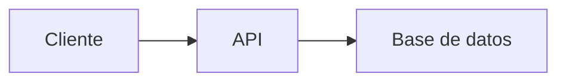

# 📚 Estudio de Roles Básicos en Desarrollo Web y Móvil

##  Recurso Usen el Link odicial para aprender git /github Todos 
https://docs.github.com/es/get-started/start-your-journey/git-and-github-learning-resources
## 0) Integrantes del equipo de estudio y sus responsabilidades en el repositorio *(actualizar)*

0. José Jiménez - josej@unsa.edu.pe  
1. Linares Taco Viviana Flobele vlinares@unsa.edu.pe
2. Mendoza Larico Delaney Dariana 
3. María
4. Motta Medina, Brayan Teodoro - bmottam@unsa.edu.pe
...  
12. 

## 1) Conceptos Generales para tener en cuenta
En el contexto de desarrollo web y móvil: diferencias entre librerías, frameworks y patrones de diseño.

## 2) Conociendo Git
Describiremos cómo nos sirve localmente para poder versionar nuestro software.

## 3) Conociendo Github  
- Describiendo el uso de repositorio remoto  
- Cómo definimos repositorio  
- Cómo configurar para permitir al equipo colaborar  
- Supervisión de posibles conflictos  

### Temas a desarrollar por los miembros del Equipo:  
**Roles básicos en el desarrollo de aplicaciones web y aplicación móvil**

## 4) Desarrollador Frontend
- Descripción del rol  
- Habilidades requeridas  
- Relación con roles de backend, QA, Desarrollador Android  
- Stack tecnológico:  
  - Lenguajes  
  - Frameworks  

## 5) Links recomendados para capacitación Rol Frontend
*(Separados por criterios)*  
🔹 **Sin certificaciones**:  
🔹 **Con certificación**:  
🔹 **Proyectos completos de ejemplo**:  
🔹 **Recomendadas por líderes (Microsoft, AWS, Google)**:  

## 6) Desarrollador Backend
💡 ¿Qué es el Backend?
El backend es la parte del desarrollo web que gestiona la lógica, bases de datos y servidores. Es lo que el usuario no ve, pero permite que todo funcione correctamente en una aplicación o sitio web.

Por ejemplo, cuando haces login en una página, el backend valida tus credenciales, accede a la base de datos y devuelve una respuesta al frontend.

🧱 Componentes del Backend
Servidor: Máquina (física o en la nube) que ejecuta la lógica del sistema.

Aplicación backend: Código que maneja la lógica de negocio (por ejemplo: Node.js, Java, Python).

Base de datos: Sistema para almacenar datos persistentes (MySQL, MongoDB, PostgreSQL).

API: Interfaz para que otras aplicaciones (por ejemplo, el frontend) se comuniquen con el backend.

Autenticación y autorización: Controlan el acceso de los usuarios a los recursos.

🛠️ Tecnologías Backend populares
Lenguajes de programación:
JavaScript (Node.js)

Python (Django, Flask)

Java (Spring Boot)

PHP (Laravel, Symfony)

Ruby (Ruby on Rails)

Go y Rust (más modernos, usados en microservicios)

Bases de datos:
Relacionales: MySQL, PostgreSQL, SQLite

NoSQL: MongoDB, Redis, Cassandra

Frameworks:
Node.js con Express.js

Django (Python)

Spring Boot (Java)

Laravel (PHP)

FastAPI (Python, muy rápido y moderno)

Herramientas DevOps (usadas en backend):
Docker, Kubernetes, Nginx

CI/CD: Jenkins, GitHub Actions

Control de versiones: Git

📡 ¿Qué hace un desarrollador Backend?
Un desarrollador backend:

Diseña la estructura de datos y modelos.

Crea API RESTful o GraphQL.

Implementa lógica del negocio.

Administra bases de datos.

Asegura seguridad y autenticación.

Optimiza el rendimiento del servidor.

Colabora con frontend y DevOps.

🔐 Temas importantes en backend
Autenticación (JWT, OAuth2, sesiones)

Autorización de roles

Manejo de errores y excepciones

Pruebas (unitarias y de integración)

Manejo de archivos

Sockets y WebSockets (para tiempo real)

Trabajo con colas (RabbitMQ, Kafka)

Middlewares

Seguridad: CORS, XSS, CSRF, encriptación

🧩 Arquitecturas comunes
Monolítica: Todo el backend en un solo sistema.

Microservicios: El backend se divide en pequeños servicios independientes.

Serverless: Código backend que corre bajo demanda (ej: AWS Lambda).

MVC (Modelo-Vista-Controlador): Patrón común para estructurar el código.

🌐 Backend y APIs
El backend generalmente expone una API para que el frontend o clientes móviles puedan hacer peticiones HTTP (GET, POST, PUT, DELETE). Por ejemplo:

h
Copiar
Editar
GET /api/users
POST /api/login
📈 Salidas profesionales
Con conocimientos de backend puedes trabajar como:

Backend Developer

Full Stack Developer

DevOps Engineer (si aprendes despliegue)

Cloud Engineer

Arquitecto de Software

🧪 Recomendaciones para aprender backend
Aprende un lenguaje base: JavaScript (Node.js) o Python son ideales para empezar.

Usa un framework popular: Express.js, Django, Laravel, etc.

Conecta con una base de datos (MySQL o MongoDB).

Crea un API RESTful simple.

Aprende sobre autenticación con JWT o sesiones.

Prueba tu API con Postman o curl.

Sube tu app a la nube (Heroku, Vercel, Render, AWS).

¿Quieres que te sugiera un plan de estudio para ser backend developer o crear un proyecto real paso a paso?

## 7) Links recomendados para capacitación Rol Backend

## 8) Rol QA

## 9) Links recomendados para capacitación Rol QA

## 10) Desarrollador Android

## 11) Links recomendados para capacitación Rol Android

## 12) Pasos a Desarrollar  
1. **Integrante 0** crea repositorio remoto: `EstudioRolesBasicos`  
2. Compartir el repositorio con compañeros:  
   - Ir a Settings ⚙️ > Collaborators  
   - Invitar usando nombre de usuario GitHub o email registrado  
3. **Compañeros invitados**:  
   - Recibirán invitación por email  
   - Clonar repositorio:  
     ```bash
     cd practica
     git clone https://github.com/jjuarez29/EstudioRolesBasicos
     cd EstudioRolesBasicos
     ```
   - Ver contenido con `dir` (Windows) o `ls` (Linux/Mac)
ejemplo de link
https://github.com/jjuarez29/PYTHON01/settings

## Conociendo algo de mermaid y markdown
**Mermaid** y **Markdown** son herramientas complementarias pero con propósitos diferentes. Aquí te explico sus diferencias y similitudes:

---

### 🔹 **Markdown** (`.md`)
Es un **lenguaje de marcado ligero** para formatear texto plano de manera sencilla, que se convierte en HTML.

**Características**:
1. **Sintaxis simple**: Usa símbolos como `#`, `*`, `>` para títulos, listas, citas, etc.
   ```markdown
   # Título
   - Lista
   **negrita**
   ```
2. **Propósito principal**: Documentación legible en repositorios (como `README.md`).
3. **Soporte nativo en GitHub/GitLab**: Se renderiza automáticamente.
4. **No es programable**: Solo estructura texto e imágenes.

---

### 🔹 **Mermaid**
Es una **librería de diagramación** que permite crear gráficos mediante código dentro de documentos Markdown.

**Características**:
1. **Sintaxis específica**: Usa bloques de código con la etiqueta `mermaid`.
   ````markdown
   ```mermaid
   graph TD
     A[Inicio] --> B{Decisión}
     B -->|Sí| C[OK]
     B -->|No| D[Error]
   ```
   ````
2. **Propósito principal**: Generar diagramas (flujos, UML, Gantt, etc.) sin herramientas externas.
3. **Requiere soporte**: Funciona en GitHub/GitLab con renderizadores compatibles (no en todos lados).
4. **Es programable**: Permite lógica para estructurar gráficos.

---

### 🔄 **Similitudes**
1. **Ambos usan texto plano**: Son legibles sin renderizar.
2. **Se integran en `.md`**: Mermaid vive dentro de bloques de código en Markdown.
3. **Uso en documentación**: Ideales para repositorios y wikis.

---

### 📌 **Diferencias clave**
| Característica       | Markdown                          | Mermaid                          |
|----------------------|-----------------------------------|----------------------------------|
| **Función**          | Formatear texto                   | Crear diagramas                  |
| **Sintaxis**         | `# Título`, `- lista`             | `graph TD`, `pie chart`          |
| **Renderizado**      | Soporte universal                 | Requiere compatibilidad          |
| **Ejemplo**          | Hacer listas o tablas             | Hacer flujogramas o secuencias   |

---

### 🛠 **Ejemplo combinado (Markdown + Mermaid)**
````markdown
# Documentación del Proyecto

## 📊 Diagrama de flujo


## 📝 Pasos
1. Ejecutar `npm install`
2. Abrir `index.html`
````

---

### ✅ **¿Cuándo usar cada uno?**
- **Usa Markdown** para:  
  READMEs, documentación, wikis, notas simples.  
- **Usa Mermaid** para:  
  Diagramas técnicos, arquitectura, flujos de trabajo.  

**Nota**: GitHub soporta ambos, pero verifica si tu plataforma (como Slack o GitLab) también renderiza Mermaid.
